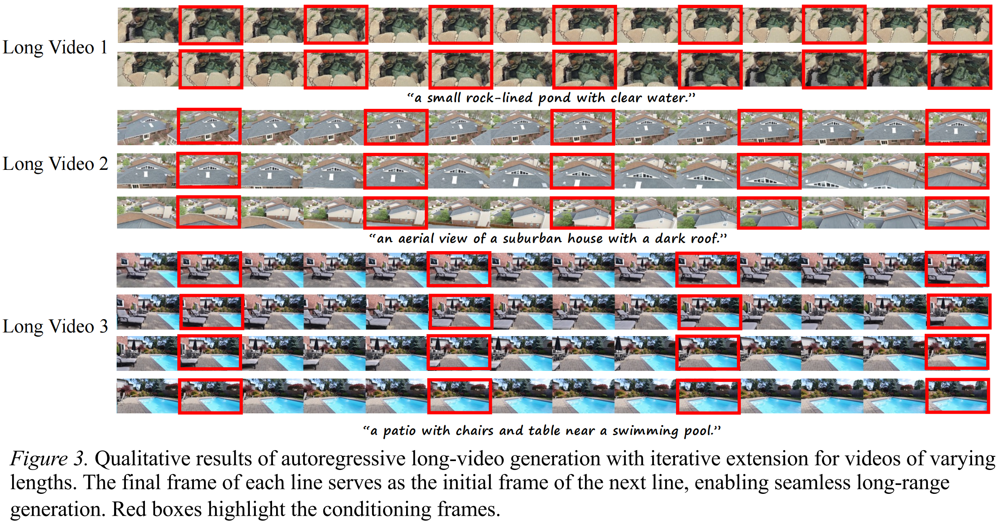

Table A: Comprehensive Zero-shot (OOD) vs. In-Domain Trained Evaluation on DL3DV and ScanNet++
| Dataset (Backbone) | Sparsity | Evaluation Setting | Method | RotError ↓ | TransError ↓ | CamMC ↓ | FVD ↓   (Style-GAN) | FVD ↓   (VideoGPT) |
| :--- | :--- | :--- | :--- | :--- | :--- | :--- | :--- | :--- |
| **DL3DV** | **1/2** | *Zero-shot (OOD)* | SVD-Base | 3.92 | 14.81 | 17.26 | 165.4 | 186.2 |
| *(U-Net)* | | | **SVD-CamGeo** | 3.06 | 10.68 | 12.19 | 148.9 | 170.6 |
| | | *In-Domain Trained* | SVD-Full | 3.44 | 12.63 | 14.31 | 154.5 | 177.8 |
| | | | SVD-Base | 2.81 | 10.14 | 11.52 | 142.8 | 161.9 |
| | | | **SVD-CamGeo** | **2.04** | **7.49** | **8.76** | **126.3** | **144.5** |
| | **1/3** | *Zero-shot (OOD)* | SVD-Base | 4.16 | 16.34 | 18.63 | 172.8 | 192.1 |
| | | | **SVD-CamGeo** | 3.34 | 13.08 | 14.47 | 153.6 | 176.3 |
| | | *In-Domain Trained* | SVD-Full | 3.73 | 14.54 | 16.21 | 163.9 | 181.6 |
| | | | SVD-Base | 3.11 | 11.85 | 13.14 | 148.7 | 168.4 |
| | | | **SVD-CamGeo** | **2.33** | **8.62** | **10.04** | **132.1** | **152.6** |
| | **1/4** | *Zero-shot (OOD)* | SVD-Base | 4.58 | 18.72 | 20.54 | 177.5 | 197.3 |
| | | | **SVD-CamGeo** | 3.64 | 14.78 | 16.42 | 161.9 | 184.2 |
| | | *In-Domain Trained* | SVD-Full | 4.12 | 16.85 | 18.52 | 170.6 | 193.1 |
| | | | SVD-Base | 3.42 | 13.51 | 15.14 | 158.4 | 180.5 |
| | | | **SVD-CamGeo** | **2.68** | **9.81** | **11.37** | **138.2** | **161.4** |
| **ScanNet++**| **1/2** | *Zero-shot (OOD)* | CogV-Base | 1.68 | 6.24 | 6.87 | 103.4 | 116.3 |
| *(DiT)* | | | **CogV-CamGeo** | 1.51 | 5.62 | 6.34 | 95.7 | 111.4 |
| | | *In-Domain Trained* | CogV-Full | 1.54 | 5.86 | 6.48 | 102.6 | 114.2 |
| | | | CogV-Base | 1.41 | 5.43 | 5.98 | 91.8 | 107.5 |
| | | | **CogV-CamGeo** | **1.26** | **4.74** | **5.34** | **86.4** | **98.7** |
| | **1/3** | *Zero-shot (OOD)* | CogV-Base | 1.84 | 6.72 | 7.31 | 109.2 | 124.6 |
| | | | **CogV-CamGeo** | 1.63 | 6.04 | 6.65 | 100.3 | 116.8 |
| | | *In-Domain Trained* | CogV-Full | 1.72 | 6.44 | 7.02 | 108.9 | 120.7 |
| | | | CogV-Base | 1.55 | 5.68 | 6.24 | 97.4 | 112.5 |
| | | | **CogV-CamGeo** | **1.38** | **4.97** | **5.58** | **90.3** | **104.2** |
| | **1/4** | *Zero-shot (OOD)* | CogV-Base | 2.05 | 7.23 | 7.85 | 116.4 | 128.5 |
| | | | **CogV-CamGeo** | 1.82 | 6.35 | 7.04 | 107.6 | 122.9 |
| | | *In-Domain Trained* | CogV-Full | 1.96 | 6.91 | 7.52 | 116.1 | 128.8 |
| | | | CogV-Base | 1.76 | 6.21 | 6.84 | 103.7 | 118.4 |
| | | | **CogV-CamGeo** | **1.54** | **5.41** | **5.98** | **93.5** | **110.1** |

---

---

---

---

---

